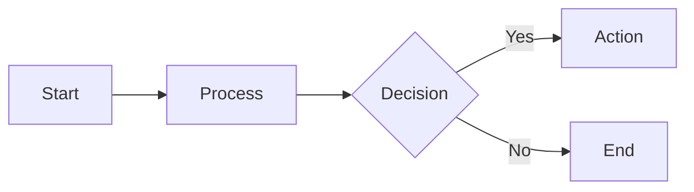
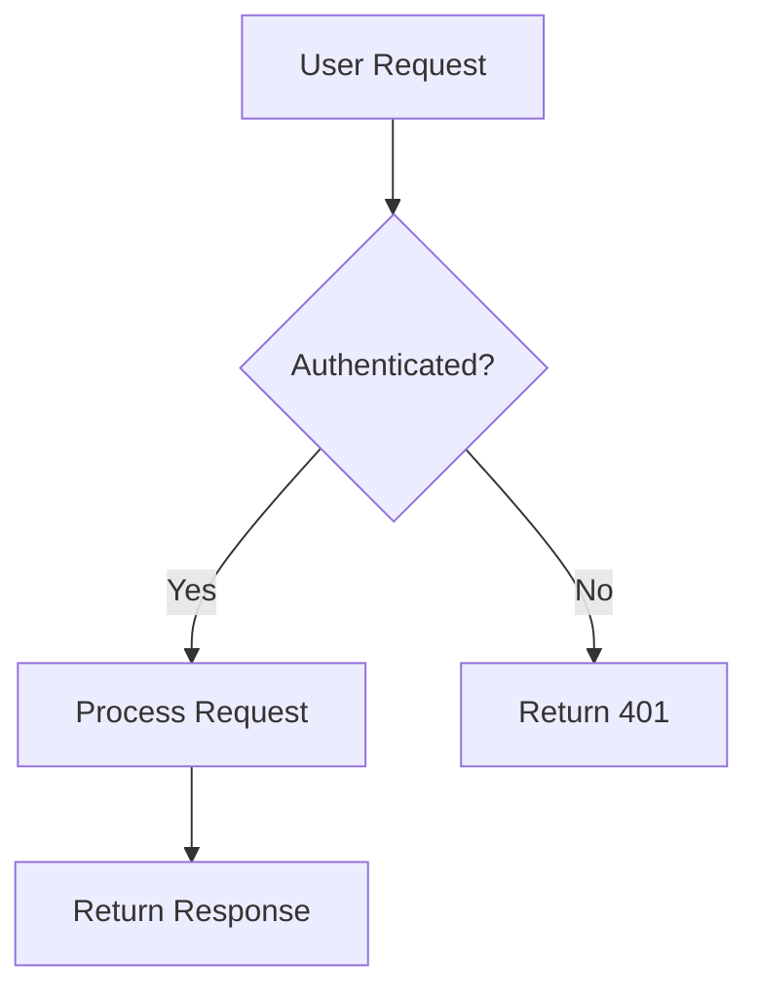
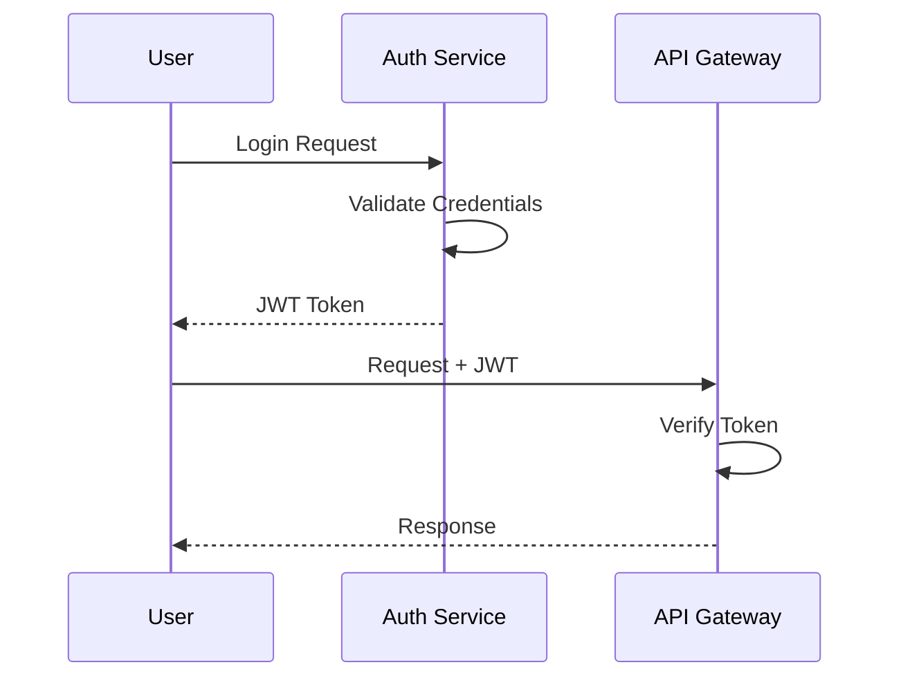
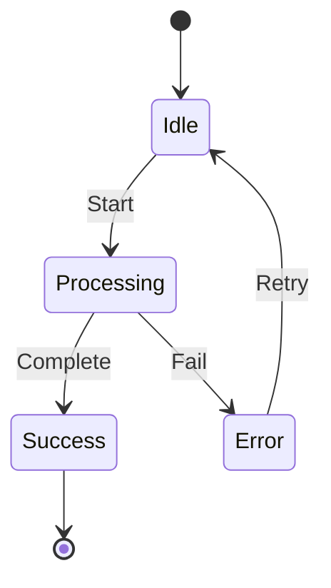
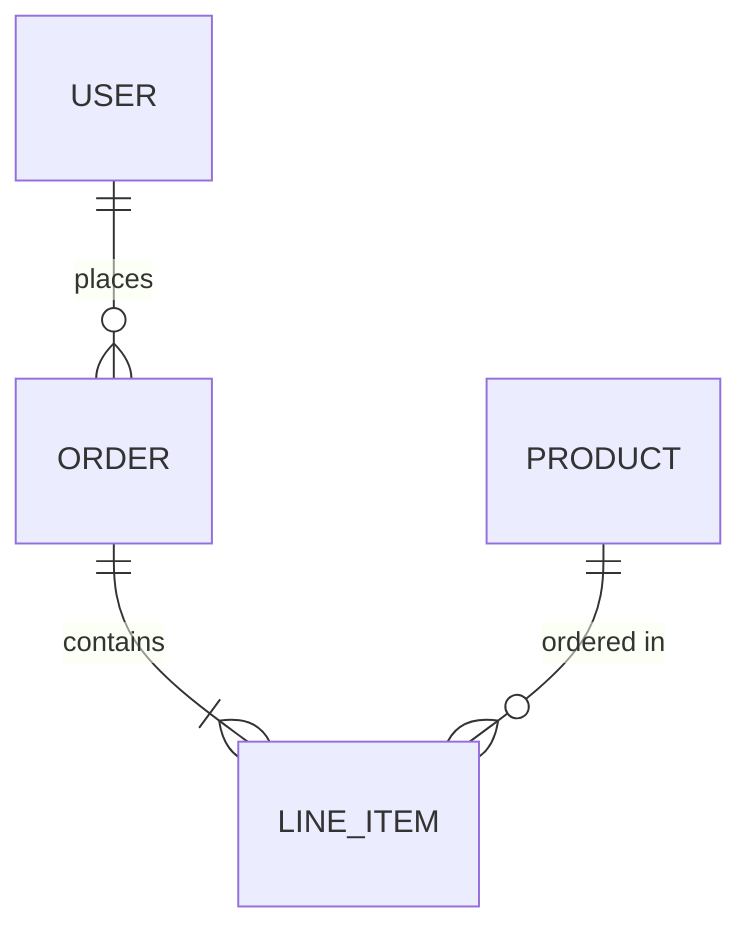
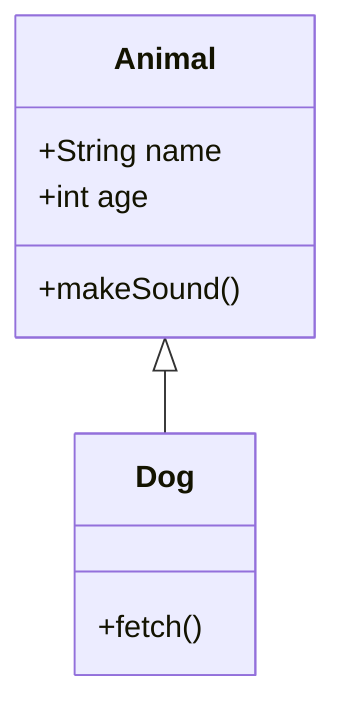
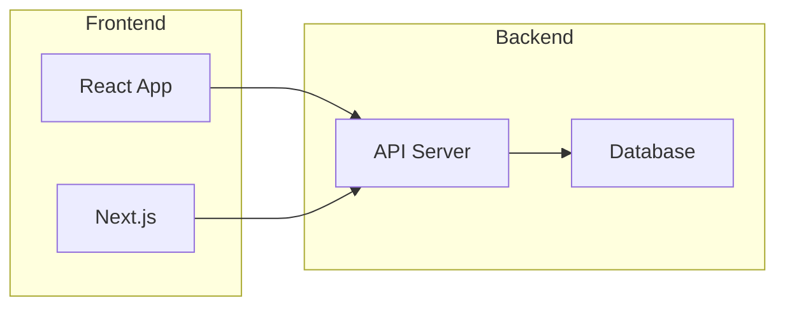
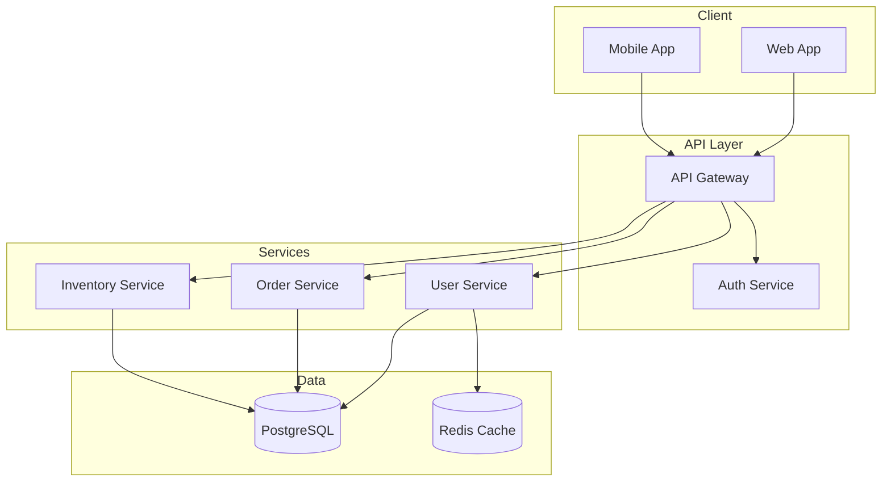

# Mermaid Diagram Workflow

**Quick visualization using Mermaid syntax - outputs directly, no CLI required.**

## When to Use

- User wants a quick flowchart, sequence diagram, or state diagram
- Output will be embedded in markdown documentation
- Standard diagram types (flowchart, sequence, ER, class, state, gantt)
- No need for custom styling beyond what Mermaid supports

## Output Format

Output raw Mermaid syntax in a fenced code block:

````markdown

````

This renders in GitHub, VS Code, Obsidian, and most modern markdown viewers.

## Diagram Types

### Flowchart (Most Common)



**Direction options:** `TD` (top-down), `LR` (left-right), `BT` (bottom-top), `RL` (right-left)

### Sequence Diagram



### State Diagram



### Entity Relationship



### Class Diagram



## Styling Guidelines

Mermaid has limited styling, but follow these conventions:

1. **Use clear, short labels** - Avoid long text in nodes
2. **Group related nodes** - Use subgraphs for logical grouping
3. **Direction matters** - `LR` for flows, `TD` for hierarchies
4. **Consistent shapes** - `[]` for process, `{}` for decision, `()` for start/end

### Subgraphs for Grouping



## Best Practices

1. **Keep it simple** - Mermaid is for quick diagrams, not complex visualizations
2. **Use participant aliases** - `participant U as User` for cleaner diagrams
3. **Add notes when needed** - `Note over A,B: Important info`
4. **Test rendering** - Preview in VS Code or GitHub before sharing

## When NOT to Use Mermaid

Switch to Excalidraw or AI generation when:
- User needs custom styling or colors
- Diagram is too complex for Mermaid's layout
- Hand-drawn aesthetic is important
- Diagram will be used in a presentation (use AI generation)

## Example: Architecture Diagram


